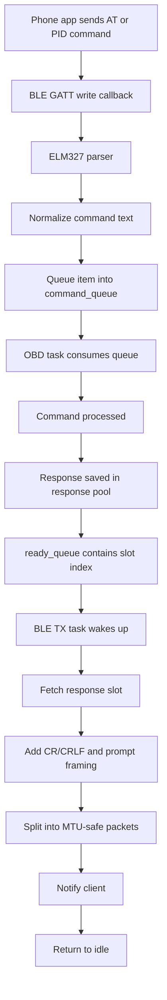

# OBD_BLE_FreeRTOS Flowchart

This file shows the runtime flow of the ESP-IDF / FreeRTOS firmware in [OBD_BLE_FreeRTOS_C](.).

## High-level architecture

```mermaid
flowchart TD
    A[BLE client sends ELM327 command] --> B[NimBLE GATT RX callback]
    B --> C[Copy command into s_command_queue]
    C --> D[OBD task on core 1]
    D --> E{Command valid?}
    E -- Yes --> F[obd2_command()]
    E -- No --> G[Return ELM error / unsupported]
    F --> H[parse_standard_obd_request or parse_non_obd_request]
    H --> I[Build CAN request frame]
    I --> J[mcp2515_transport_send()]
    J --> K[MCP2515 TX buffer]
    K --> L[Vehicle CAN bus]
    L --> M[MCP2515 RX interrupt / polling]
    M --> N[mcp2515_transport_receive()]
    N --> O[Decode ISO-TP / frame assembly / PID parsing]
    O --> P[Store response in response pool]
    P --> Q[response_ready_queue]
    Q --> R[BLE TX task on core 0]
    R --> S[Build ELM327 response string]
    S --> T[MTU chunked BLE notification]
    T --> U[Mobile app / OBD tool]

    D --> V[obd2_poll()]
    V --> W{Any pending CAN response?}
    W -- Yes --> X[Read CAN frame]
    X --> Y[Assemble ISO-TP message]
    Y --> O
    W -- No --> Z[Idle / taskYIELD / 1 ms delay]
```

## Detailed startup flow

```mermaid
flowchart TD
    A[app_main()] --> B[init_nvs()]
    B --> C[Create static FreeRTOS queues]
    C --> D[response pool init]
    D --> E[mcp2515_transport_init_bus()]
    E --> F[spi_bus_initialize + spi_bus_add_device]
    F --> G[obd2_init()]
    G --> H[Initialize MCP2515 timing and receive mode]
    H --> I[elm327_ble_init()]
    I --> J[Create obd_can task pinned to core 1]
    J --> K[Create ble_tx task pinned to core 0]
    K --> L[elm327_ble_start_host()]
    L --> M[System ready]
```

## OBD task loop

```mermaid
flowchart TD
    A[Start obd_task()] --> B[obd2_poll(obd)]
    B --> C{Any incoming CAN data?}
    C -- Yes --> D[Read CAN frame]
    D --> E[ISO-TP / response parsing]
    E --> F[Update OBD state and caches]
    F --> G[Queue prepared response]
    C -- No --> H[No new work]
    H --> I{Any BLE command in s_command_queue?}
    I -- Yes --> J[obd2_command(obd, command.text)]
    J --> K[Validate / parse request]
    K --> L[Build standard or non-OBD request]
    L --> M[Send transaction to MCP2515]
    M --> N[obd2_poll(obd)]
    N --> O[Continue loop]
    I -- No --> P{obd2_busy(obd)?}
    P -- Yes --> Q[taskYIELD()]
    P -- No --> R{did_work?}
    R -- No --> S[vTaskDelay(1)]
    R -- Yes --> Q
```

## BLE RX / TX path



## CAN send / receive path

```mermaid
flowchart TD
    A[obd2_command()] --> B{Is request standard OBD or custom branch?}
    B -- Standard PID --> C[Build 11-bit CAN request]
    B -- Custom non-OBD --> D[parse_non_obd_request()]
    D --> E[Map to response_id like 0x60D or 0x208]
    E --> C
    C --> F[mcp2515_transport_send()]
    F --> G[Wait for TXB0 clear]
    G --> H[Write SIDH/SIDL/DLC/data to MCP2515 TX buffer]
    H --> I[Send RTS to transmit]
    I --> J[Wait until TX request clears]
    J --> K[Return success/failure]

    K --> L[Vehicle responds]
    L --> M[mcp2515_transport_receive()]
    M --> N[Read CANINTF and RXB0/RXB1]
    N --> O[Decode 11-bit or extended ID + DLC + data]
    O --> P[Queue frame for OBD protocol processing]
    P --> Q[obd2_poll() extracts the response]
```

## Request parsing flow

```mermaid
flowchart TD
    A[Command string arrives] --> B{String length and format valid?}
    B -- No --> C[Return "ERROR"]
    B -- Yes --> D{Starts with 0x01..0x0A or other PID mode?}
    D -- Yes --> E[Standard OBD-II request]
    D -- No --> F{Matches custom non-OBD mapping?}
    F -- Yes --> G[parse_non_obd_request()]
    G --> H[Set response_id to 0x60D or 0x208]
    H --> I[Send CAN message]
    F -- No --> J[Unsupported command]

    E --> K[Mode 01 / 02 / 03 / 04 / 07 / 09 / 0A logic]
    K --> L[Generate request frames]
    L --> M[Send over CAN]
```

## Key execution model

- `app_main()` initializes NVS, queues, the MCP2515 SPI bus, the OBD state, and BLE.
- The `obd_can` task owns all CAN and OBD protocol state. It is pinned to core 1.
- The BLE host stack handles GATT events independently.
- The `ble_tx` task only sends notifications, and it is pinned to core 0.
- Commands are moved from BLE into a FreeRTOS queue instead of calling CAN directly from the BLE callback.
- Responses are stored in a fixed-size pool and queued by slot index to avoid repeated heap allocations.

## File map

- [main/app_main.c](main/app_main.c) — startup, queue creation, task creation, system init
- [main/Transport/MCP2515Transport.c](main/Transport/MCP2515Transport.c) — SPI + MCP2515 send/receive logic
- [main/Core/OBD2.c](main/Core/OBD2.c) — request parsing, ISO-TP handling, PID logic, cache updates
- [main/BLE/ELM327_BLE.c](main/BLE/ELM327_BLE.c) — BLE command receive path and TX notification path
- [main/BLE/ELM327Protocol.c](main/BLE/ELM327Protocol.c) — ELM327 command parsing and command framing behavior

## Summary

The firmware is designed as a single-owner OBD system:

1. BLE receives a command.
2. The command is queued.
3. The OBD task parses it and sends the CAN request.
4. The MCP2515 receives the ECU response.
5. ISO-TP / PID data is decoded and cached.
6. The response is queued for BLE notification.
7. The BLE task sends the reply back to the client.

This structure avoids locking around the MCP2515 and keeps timing-sensitive CAN work off the BLE host path.
