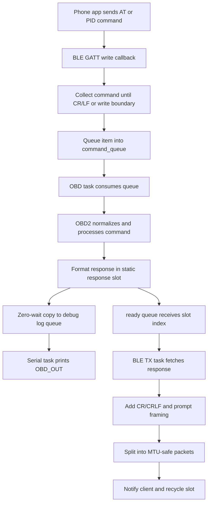

# OBD_BLE_FreeRTOS Flowchart

This file shows the runtime flow of the ESP-IDF / FreeRTOS firmware in [OBD_BLE_FreeRTOS_C](.).

## High-level architecture

```mermaid
flowchart TD
    A[BLE client sends ELM327 command] --> B[NimBLE GATT RX callback]
    B --> C[Copy command into s_command_queue]
    C --> D[OBD task on core 1]
    D --> E{Command valid?}
    E -- Yes --> F[obd2_command()]
    E -- No --> G[Return ELM error / unsupported]
    F --> H[Parse AT, standard OBD, or custom command]
    H --> I[Build CAN request frame]
    I --> J[mcp2515_transport_send()]
    J --> K[MCP2515 TX buffer]
    K --> L[Vehicle CAN bus]
    L --> M[OBD task polls MCP2515]
    M --> N[mcp2515_transport_receive()]
    N --> O[Reassemble ISO-TP and format OBD response]
    O --> P[Copy response to static response slot]
    P --> Q[Zero-wait enqueue to debug log queue]
    Q --> R[Low-priority serial logger]
    R --> S[ESP_LOGI tag OBD_OUT]
    P --> T[Queue response slot index]
    T --> V[BLE TX task on core 0]
    V --> W[Add ELM CR/CRLF and prompt]
    W --> X[MTU chunked BLE notification]
    X --> U[Mobile app / OBD tool]

    D --> AA[obd2_poll()]
    AA --> AB{Any pending CAN response?}
    AB -- Yes --> AC[Read CAN frame]
    AC --> AD[Assemble ISO-TP message]
    AD --> O
    AB -- No --> AE[Idle / taskYIELD / 1 ms delay]
```

## Detailed startup flow

```mermaid
flowchart TD
    A[app_main()] --> B[init_nvs()]
    B --> C[Create static FreeRTOS queues]
    C --> D[Initialize response and debug log pools]
    D --> E[mcp2515_transport_init_bus()]
    E --> F[spi_bus_initialize + spi_bus_add_device]
    F --> G[obd2_init()]
    G --> H[Initialize MCP2515 timing and receive mode]
    H --> I[elm327_ble_init()]
    I --> J[Create obd_serial_log task on core 0]
    J --> K[Create obd_can task pinned to core 1]
    K --> L[Create ble_tx task pinned to core 0]
    L --> M[elm327_ble_start_host()]
    M --> N[System ready]
```

## OBD task loop

```mermaid
flowchart TD
    A[Start obd_task()] --> B[obd2_poll(obd)]
    B --> C{Any incoming CAN data?}
    C -- Yes --> D[Read CAN frame]
    D --> E[ISO-TP / response parsing]
    E --> F[Update OBD state and caches]
    F --> G[Queue prepared response]
    C -- No --> H[No new work]
    H --> I{Any BLE command in s_command_queue?}
    I -- Yes --> J[obd2_command(obd, command.text)]
    J --> K[Validate / parse request]
    K --> L[Build standard or non-OBD request]
    L --> M[Send transaction to MCP2515]
    M --> N[obd2_poll(obd)]
    N --> O[Continue loop]
    I -- No --> P{obd2_busy(obd)?}
    P -- Yes --> Q[taskYIELD()]
    P -- No --> R{did_work?}
    R -- No --> S[vTaskDelay(1)]
    R -- Yes --> Q
```

## BLE RX / TX path



## CAN send / receive path

```mermaid
flowchart TD
    A[obd2_command()] --> B{Is request standard OBD or custom branch?}
    B -- Standard PID --> C[Build 11-bit CAN request]
    B -- Custom non-OBD --> D[parse_non_obd_request()]
    D --> E[Map to response_id like 0x60D or 0x208]
    E --> C
    C --> F[mcp2515_transport_send()]
    F --> G[Wait for TXB0 clear]
    G --> H[Write SIDH/SIDL/DLC/data to MCP2515 TX buffer]
    H --> I[Send RTS to transmit]
    I --> J[Wait until TX request clears]
    J --> K[Return success/failure]

    K --> L[Vehicle responds]
    L --> M[obd2_poll() polls MCP2515]
    M --> N[Read CANINTF and RXB0/RXB1]
    N --> O[Decode CAN ID + DLC + data]
    O --> P[Process frame in OBD task]
    P --> Q[Reassemble ISO-TP and format response]
```

## Request parsing flow

```mermaid
flowchart TD
    A[Command string arrives] --> B[Normalize case and whitespace]
    B --> C{AT command?}
    C -- Yes --> D[Process locally and queue response]
    C -- No --> E{Matches custom non-OBD mapping?}
    E -- Yes --> F[Set expected custom CAN response ID]
    F --> G[Send custom CAN request]
    E -- No --> H{Valid supported OBD service and hex payload?}
    H -- Yes --> I[Build standard OBD request]
    I --> J[Send over CAN]
    H -- No --> K[Queue "?"]
```

## Key execution model

- `app_main()` initializes NVS, queues, the MCP2515 SPI bus, the OBD state, and BLE.
- The `obd_can` task owns all CAN and OBD protocol state. It is pinned to core 1.
- The BLE host stack handles GATT events independently.
- The `ble_tx` task only sends notifications, and it is pinned to core 0.
- The low-priority `obd_serial_log` task prints response copies from a static queue.
- Debug queue writes use zero wait; a full queue drops a log message rather than stalling CAN processing.
- Commands are moved from BLE into a FreeRTOS queue instead of calling CAN directly from the BLE callback.
- Responses are stored in a fixed-size pool and queued by slot index to avoid repeated heap allocations.

## File map

- [main/app_main.c](main/app_main.c) — startup, queue creation, task creation, system init
- [main/Transport/MCP2515Transport.c](main/Transport/MCP2515Transport.c) — SPI + MCP2515 send/receive logic
- [main/Core/OBD2.c](main/Core/OBD2.c) — request parsing, ISO-TP handling, PID logic, cache updates
- [main/BLE/ELM327_BLE.c](main/BLE/ELM327_BLE.c) — BLE command receive path and TX notification path
- The serial logger task is implemented in [main/app_main.c](main/app_main.c).

## Summary

The firmware is designed as a single-owner OBD system:

1. BLE receives a command.
2. The command is queued.
3. The OBD task parses it and sends the CAN request.
4. The MCP2515 receives the ECU response.
5. ISO-TP / PID data is decoded and cached.
6. The response is queued for BLE notification.
7. The BLE task sends the reply back to the client; the serial logger independently prints a copy for debugging.

This structure avoids locking around the MCP2515 and keeps timing-sensitive CAN work off the BLE host path.
