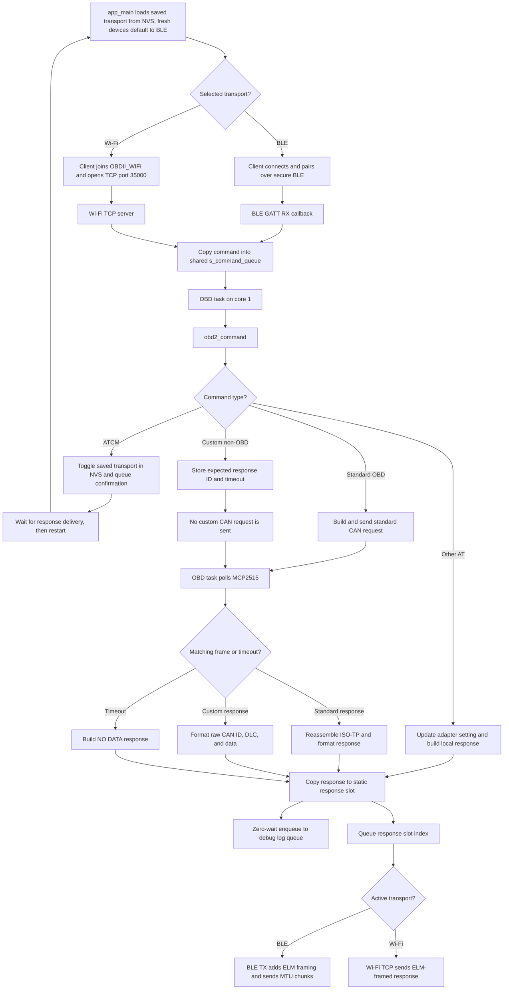
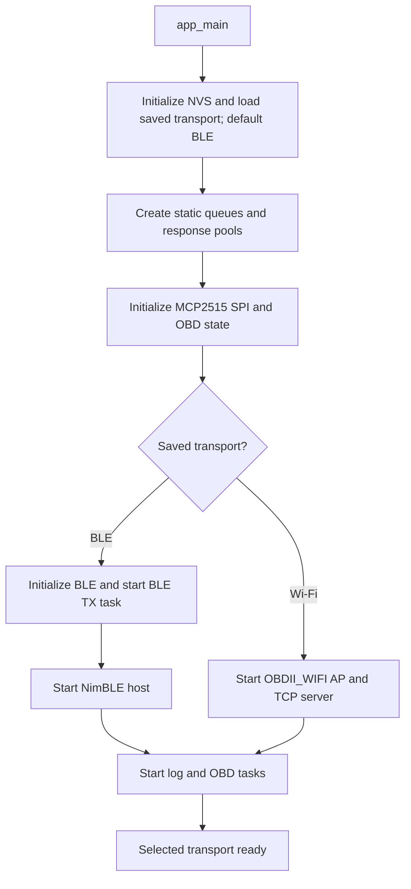
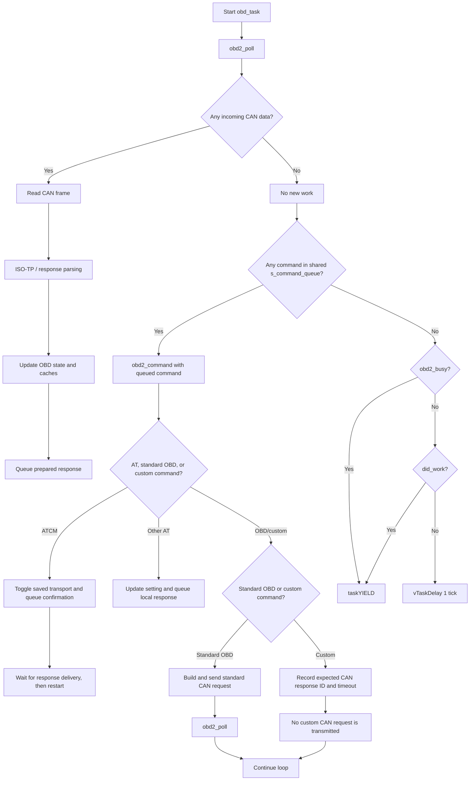
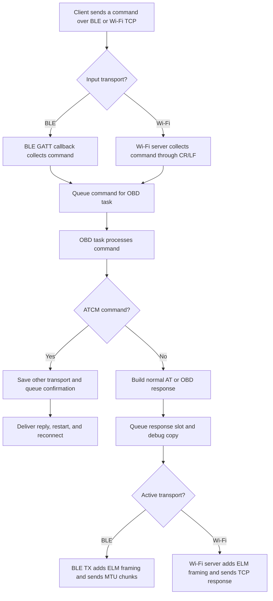
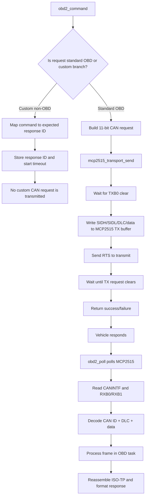
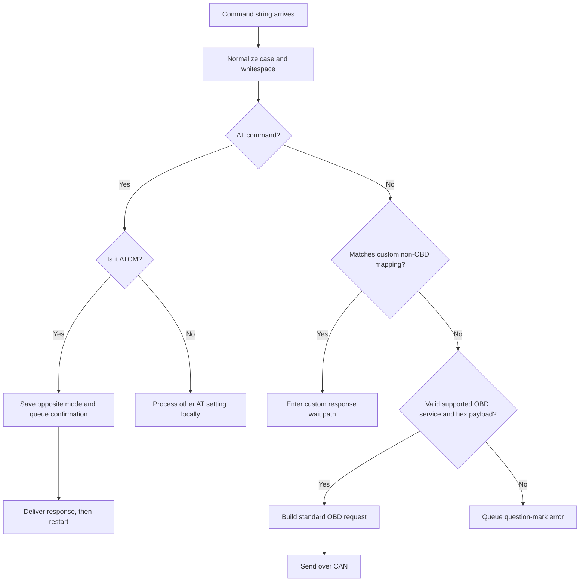
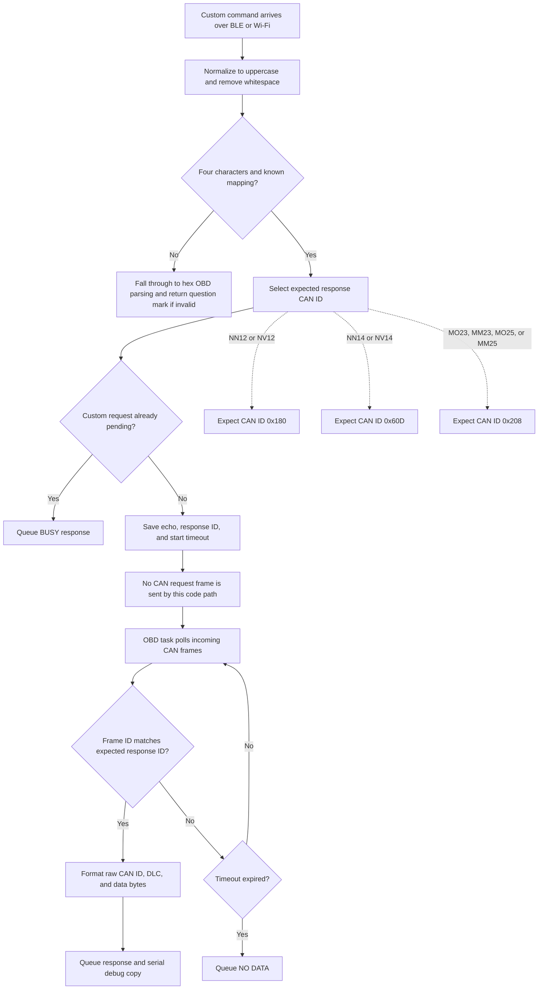

# OBD_BLE_FreeRTOS Flowchart

This file shows the runtime flow of the ESP-IDF / FreeRTOS firmware in [OBD_BLE_FreeRTOS_C](.).

## High-level architecture

## Detailed startup flow

## OBD task loop

## BLE / Wi-Fi RX / TX path

## CAN send / receive path

## Request parsing flow

## Custom / non-OBD command process

## Key execution model

- `app_main()` initializes NVS, loads the saved transport (BLE by default), then starts that transport.
- The `obd_can` task owns all CAN and OBD protocol state. It is pinned to core 1.
- BLE GATT and Wi-Fi TCP input both feed the shared command queue.
- BLE notifications and Wi-Fi TCP responses use the same response pool and ELM framing.
- `ATCM` saves the other transport, queues a confirmation, then restarts into that mode.
- The low-priority `obd_serial_log` task prints response copies from a static queue.
- Debug queue writes use zero wait; a full queue drops a log message rather than stalling CAN processing.
- Commands are moved into a FreeRTOS queue instead of calling CAN from a transport callback.
- Responses are stored in a fixed-size pool and queued by slot index to avoid repeated heap allocations.

## File map

- [main/app_main.c](main/app_main.c) — startup, queue creation, task creation, system init
- [main/Transport/MCP2515Transport.c](main/Transport/MCP2515Transport.c) — SPI + MCP2515 send/receive logic
- [main/Core/OBD2.c](main/Core/OBD2.c) — request parsing, ISO-TP handling, PID logic, cache updates
- [main/BLE/ELM327_BLE.c](main/BLE/ELM327_BLE.c) — BLE command receive path and TX notification path
- [main/WiFi/WiFiTransport.c](main/WiFi/WiFiTransport.c) — Wi-Fi AP, TCP command receive, and response path
- The serial logger task is implemented in [main/app_main.c](main/app_main.c).

## Summary

The firmware is designed as a single-owner OBD system:

1. BLE or Wi-Fi receives a command.
2. The command is queued.
3. The OBD task classifies the command. `ATCM` toggles the saved transport and restarts; standard OBD requests are sent on CAN; custom commands only store an expected response ID and timeout.
4. The MCP2515 is polled for incoming frames. Standard replies use ISO-TP; matching custom replies are formatted as raw CAN data.
5. The response is queued for the active transport and copied to the serial logger without waiting.
6. The active BLE or Wi-Fi transport sends the reply to the client.

This structure avoids locking around the MCP2515 and keeps timing-sensitive CAN work off the BLE and Wi-Fi transport paths.
