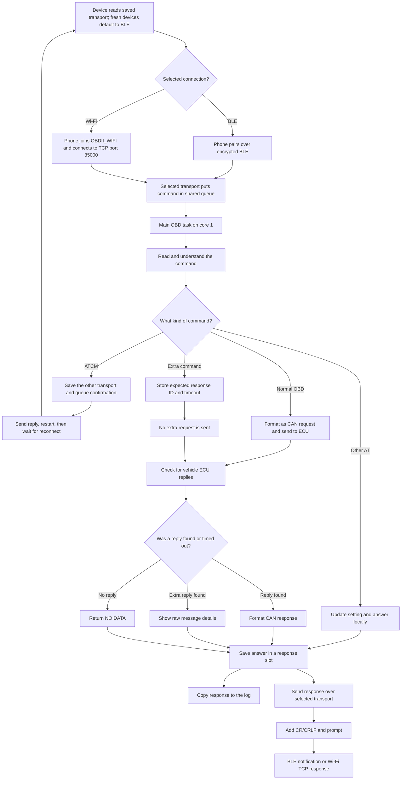
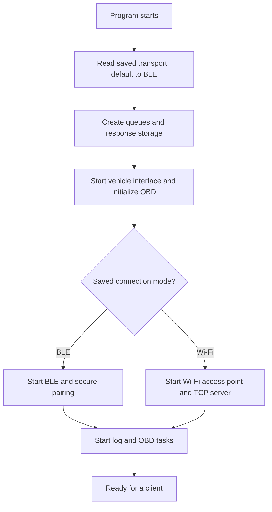
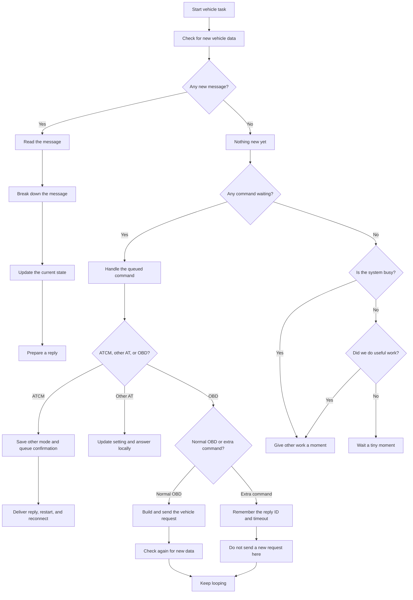
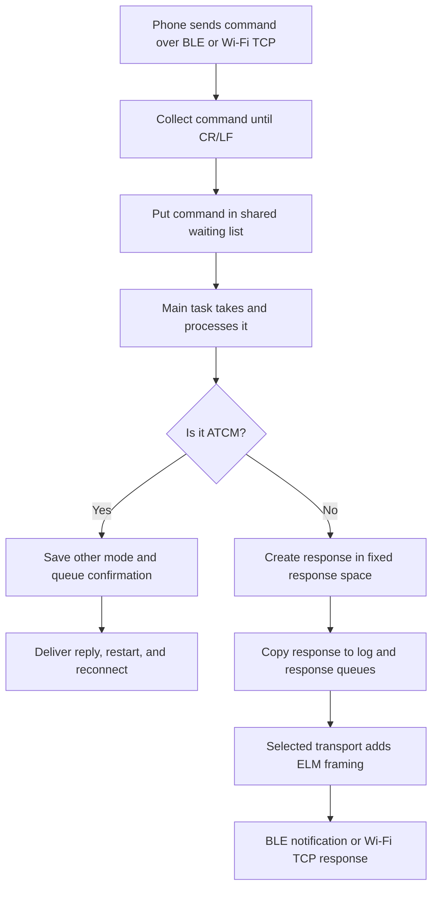
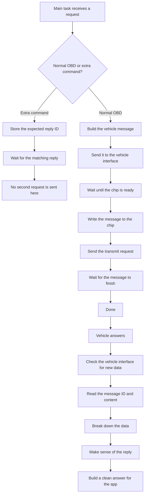
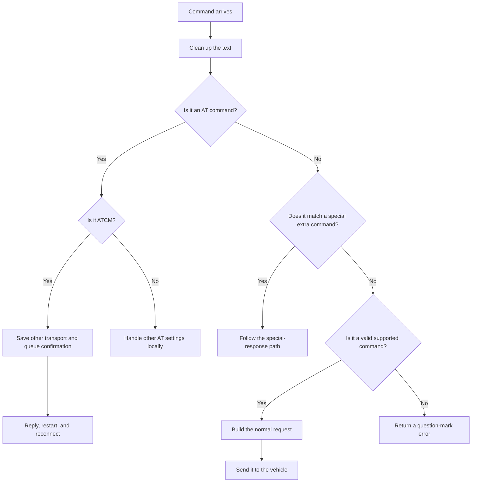
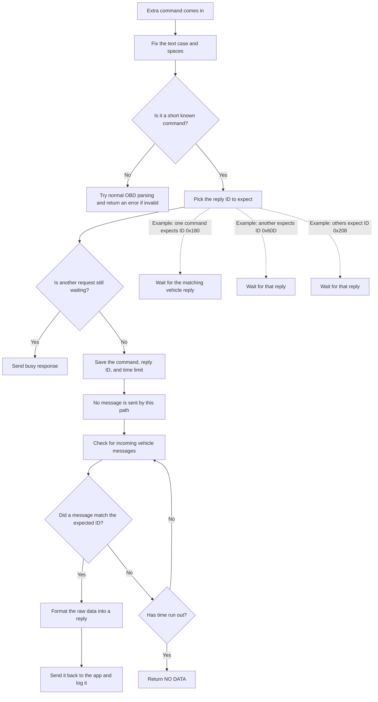

# OBD_BLE_FreeRTOS Simple Flowchart

This file shows the same system flow as the main flowchart, but with easier wording and fewer technical terms.

## Big-picture view

## Startup flow

## Main task loop

## BLE and Wi-Fi send/receive path

## Vehicle request and reply path

## Request checking flow

## Extra command path

## Simple execution model

- The program reads the saved transport from NVS; a fresh device defaults to BLE.
- The BLE stack is configured for secure pairing and bonding.
- Wi-Fi mode starts the `OBDII_WIFI` access point and TCP server.
- The main task checks for new messages from the vehicle.
- BLE and Wi-Fi clients both send commands to the same waiting list.
- The main task reads the command and decides what to do.
- `ATCM` saves the other transport, sends a confirmation, then restarts into it.
- Normal vehicle requests are sent to the car.
- Extra commands mostly remember what reply to look for and wait.
- When a reply arrives, it is cleaned up and sent back through the selected transport.
- A small background task writes logs without slowing the vehicle work.

## Main files

- [main/app_main.c](main/app_main.c) — startup, queue setup, and task setup
- [main/Transport/MCP2515Transport.c](main/Transport/MCP2515Transport.c) — vehicle interface and message transfer
- [main/Core/OBD2.c](main/Core/OBD2.c) — command handling and reply building
- [main/BLE/ELM327_BLE.c](main/BLE/ELM327_BLE.c) — Bluetooth command and notification flow
- [main/WiFi/WiFiTransport.c](main/WiFi/WiFiTransport.c) — Wi-Fi access point and TCP command/response flow

## Summary

The system works in a simple order:

1. The device starts its saved transport; BLE is the fresh-device default.
2. The command is placed in a waiting list.
3. The main task handles AT settings, uses `ATCM` to switch transports, or sends a normal/special request.
4. The vehicle side checks for replies.
5. The response is prepared and returned over BLE or Wi-Fi.
6. A small log task copies the result without slowing the main work.

This keeps the system smooth and avoids stopping the vehicle work while a transport is active.
